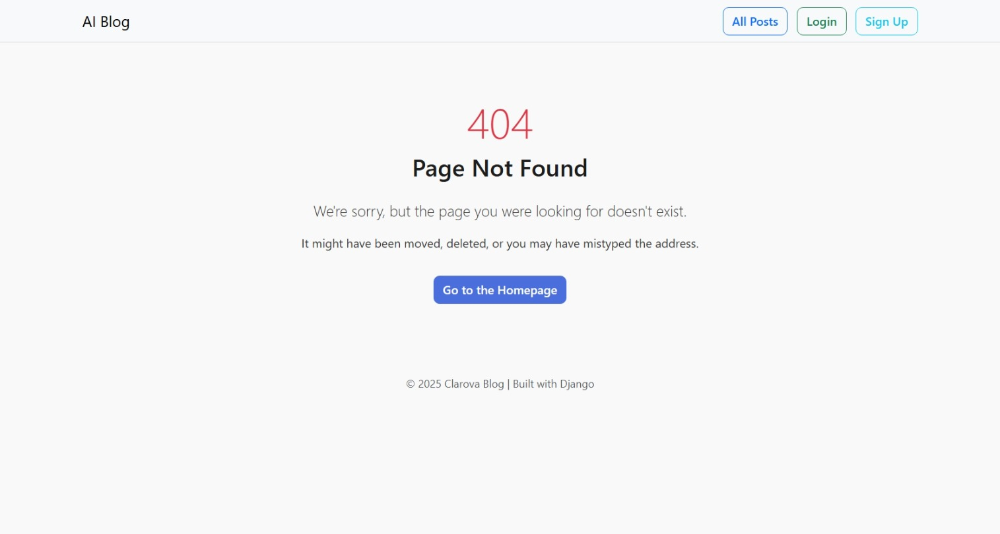
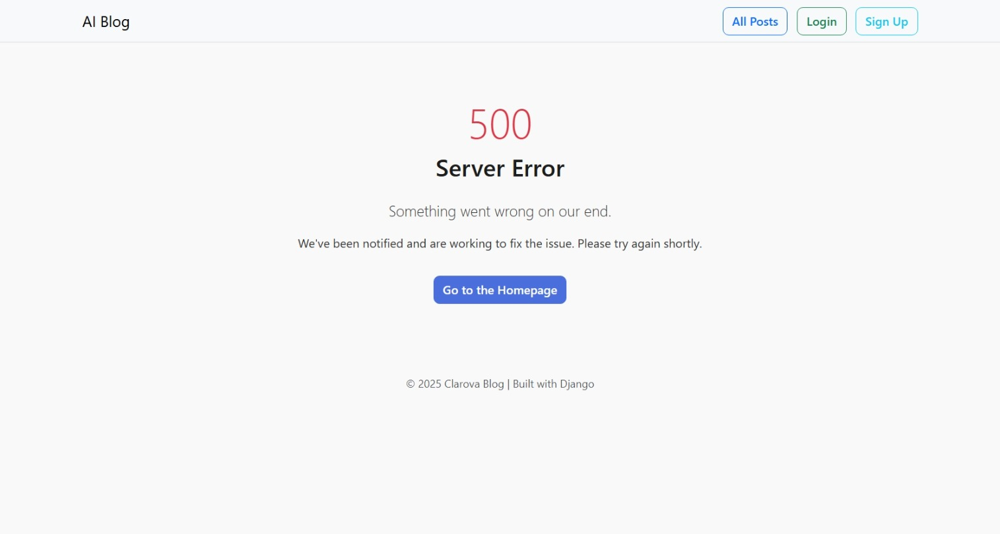
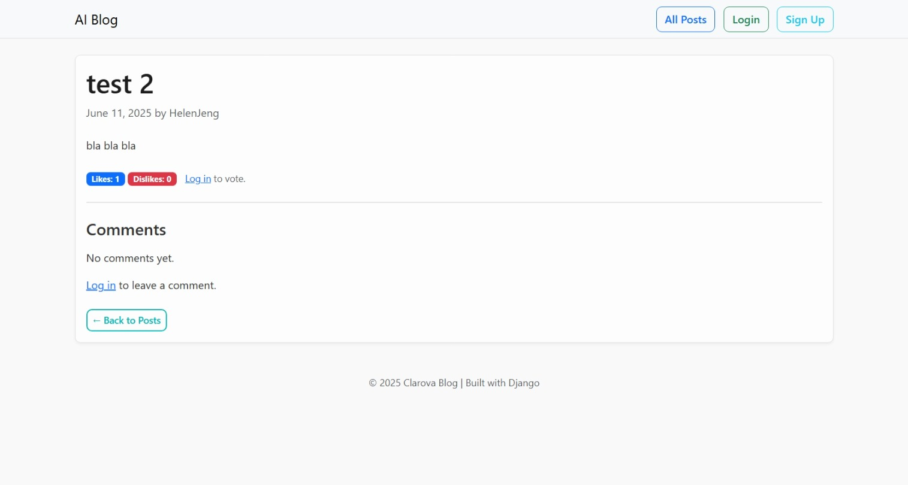
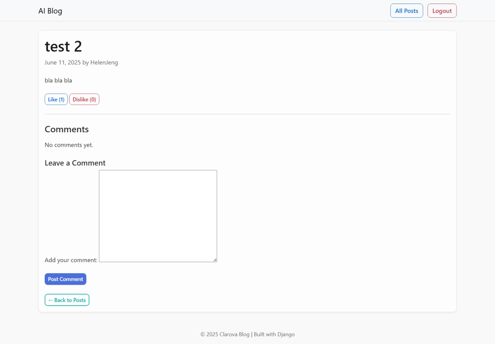

# Clarova Blog

Clarova Blog is part of the Clarova AI training ecosystem — a Django-based platform showcasing responsible AI and communications. It lets users explore, comment on, and engage with AI ethics content in a clean, professional interface. Built to demonstrate full CRUD functionality, authentication, and modern UI styling, the blog reflects Clarova’s brand colours and UX standards. Deployed on **Heroku**.

---
## User Stories

### Visitor
**B-001.** As a visitor, I want to browse all blog posts so I can read content without an account.  
**Acceptance criteria**
- Given I visit `/posts/`, I see a paginated list of published posts with title, date, author, and excerpt.
- Given I click a post, I see its full content at `/post/<id>/`.

**B-002.** As a visitor, I want to understand how to engage, so I know I must log in to comment.  
**Acceptance criteria**
- On the post detail page, if I am not logged in, I see “Log in to leave a comment” with a working login link.

### Registered user (reader)
**C-001.** As a logged-in user, I want to comment on a post so I can join the discussion.  
**Acceptance criteria**
- Given I am logged in and submit a valid comment on a post, then it saves and appears under “Comments” with my username and timestamp.
- Invalid input shows inline form errors and does not save.

**C-002.** As a logged-in user, I want helpful feedback after actions so I know what happened.  
**Acceptance criteria**
- After a successful comment, I see a success message. On failure, I see an error and the form preserves my input.

**C-003.** As a logged-in user, I want to like or dislike a post so I can quickly show my approval or disapproval.**
**Acceptance criteria**
Given I am logged in, I see "Like" and "Dislike" buttons on the post detail page. When I click a button, the count updates instantly via JavaScript, and a success message confirms the vote was saved. Clicking the same button twice removes my vote.

### Author or Admin
**A-001.** As an admin, I want to create, edit, and delete posts so I can manage site content.  
**Acceptance criteria**
- Only staff or superusers can access create, edit, and delete for posts.
- After create, edit, or delete, I am redirected to a sensible page with a success message.
- Direct URL access by non-staff is blocked or redirected.

**A-002.** As an admin, I want posts ordered and discoverable so the blog feels professional.  
**Acceptance criteria**
- Posts list in reverse chronological order.
- Each post has a stable URL and appears in the list after publish.

### Non-functional
**N-001.** Accessibility: as a keyboard user, I can navigat

## 🚀 Deployment

Access the live application here:  
👉 [https://ai-tools-training-blog-1e0b713a3de5.herokuapp.com/](https://ai-tools-training-blog-1e0b713a3de5.herokuapp.com/)

## 🔑 Admin Credentials (for assessment only)

**Username:** admin  
**Password:** SecureTemp123

## 🖼️ Application Preview

---

## 📚 Features

- User authentication (sign up, log in, log out)
- Create, edit, and delete blog posts (superuser only)
- User voting (like/dislike) on posts with real-time feedback (via JavaScript).
- Responsive design using HTML templates
- SQLite for development database
- Production deployment on Heroku
- Fully Responsive Navbar: The main navigation bar is now properly collapsible on mobile devices, ensuring a clean user experience on small screens.
- Django Messages Framework Implemented:-Logic added to `base.html` to display informative, styled feedback (e.g., success, error) to users after key actions.

### UX & Quality Tighteners

- **Messages area:** Base template renders Django messages so users see success or error notices after actions (for example, after posting a comment).
- **Error pages:** Custom 403, 404, and 500 templates added for a friendlier experience when something goes wrong.
- **Validation UX:** Comment form shows field and non-field errors inline with clear styling.
- **Post ordering:** Posts are ordered by `-created_at` in the model `Meta` and documented here for clarity.
- **AJAX/JavaScript Voting:** User votes are handled asynchronously without a page refresh, ensuring a smooth, modern user experience.

---
## 🎨 UX & Design

The Clarova Blog follows Clarova’s brand identity:
- **Colour Palette:** Clarova Blue `#4A6EDB` and Teal `#3AC7B5` for trust and innovation.
- **Typography:** Poppins (headings) and Open Sans (body) for readability and consistency.
- **Layout:** Bootstrap 5 grid with custom overrides in `app.css`.
- **Accessibility:** All buttons, forms, and links maintain WCAG contrast ratios. Nav includes ARIA labels.

---
## 🛠️ Technologies Used

 **Python 3.12**
- **Django 4.2.20**
- **PostgreSQL** (via Heroku)
- **HTML5 / CSS3**
- **WhiteNoise** for static files
- **Gunicorn** as WSGI server
- **Git & GitHub** for version control
- **Heroku** for cloud deployment
---

# 📁 Project Structure

├── blog/ # Blog logic (models, views, urls, forms)
├── templates/ # HTML templates
│ ├── base.html
│ ├── home.html
│ └── blog/
├── static/ # CSS and image files
├── my_project/ # Core settings, urls, wsgi
├── manage.py # Django management script
└── requirements.txt # Dependencies

## 🧩 Wireframes (Text-Based Layout)

Below is a simplified text wireframe representing the main pages and navigation flow of the Clarova Blog.

────────────────────────────────────────────
🏠  HOME PAGE  (`/`)
────────────────────────────────────────────
 ┌────────────────────────────────────────┐
 │ NAVBAR                                │
 │ [Clarova Logo]  Home | All Posts | Login │
 └────────────────────────────────────────┘

 ┌────────────────────────────────────────┐
 │ HERO SECTION                           │
 │ "Welcome to the Clarova Blog"           │
 │ "Exploring responsible AI, communications, and innovation." │
 │ [Browse Posts]  (Primary CTA button)    │
 └────────────────────────────────────────┘

 ┌────────────────────────────────────────┐
 │ FEATURED / INTRO SECTION                │
 │ "Insights for AI in Communications"     │
 │ Short paragraph about Clarova’s mission │
 └────────────────────────────────────────┘

 ┌────────────────────────────────────────┐
 │ FOOTER                                 │
 │ © Clarova 2025 – Responsible AI & Comms │
 └────────────────────────────────────────┘

────────────────────────────────────────────
📰  ALL POSTS PAGE  (`/posts/`)
────────────────────────────────────────────
 ┌────────────────────────────────────────┐
 │ NAVBAR (same as home)                  │
 └────────────────────────────────────────┘

 ┌────────────────────────────────────────┐
 │ PAGE TITLE: "All Posts"                │
 │ [Search bar / Pagination links]        │
 │                                        │
 │ Post Card                              │
 │ ┌────────────────────────────────────┐ │
 │ │ Post Title                         │ │
 │ │ Date | Author                      │ │
 │ │ Short excerpt (30 words)           │ │
 │ │ [Read More] (Clarova-blue button)  │ │
 │ └────────────────────────────────────┘ │
 │ Repeat for each post (paginated)       │
 └────────────────────────────────────────┘

────────────────────────────────────────────
📖  POST DETAIL PAGE  (`/post/<id>/`)
────────────────────────────────────────────
 ┌────────────────────────────────────────┐
 │ NAVBAR                                 │
 └────────────────────────────────────────┘

 ┌────────────────────────────────────────┐
 │ POST TITLE                             │
 │ Date | Author                          │
 │────────────────────────────────────────│
 │ Post Body (Markdown rendered)          │
 │ - Headings styled in Clarova blue      │
 │ - Paragraph text with good line height │
 │ - Blockquotes with teal accent bar     │
 │                                        │
 │ 👍 Like (count)   👎 Dislike (count)   │
 │ [Login to comment] or comment form     │
 │ User comments list below               │
 └────────────────────────────────────────┘

 ┌────────────────────────────────────────┐
 │ FOOTER                                 │
 └────────────────────────────────────────┘

────────────────────────────────────────────
🔑  AUTH PAGES  (`/login/`, `/signup/`)
────────────────────────────────────────────
 ┌────────────────────────────────────────┐
 │ NAVBAR                                 │
 └────────────────────────────────────────┘

 ┌────────────────────────────────────────┐
 │ FORM CARD                              │
 │ "Login to your account" / "Sign up"    │
 │ Email: [___________]                   │
 │ Password: [___________]                │
 │ [Submit] (Clarova blue button)         │
 │ [Link to switch between login/signup]  │
 └────────────────────────────────────────┘

────────────────────────────────────────────
⚙️  ADMIN DASHBOARD  (`/admin/`)
────────────────────────────────────────────
Default Django admin interface for managing posts, users, and comments.

────────────────────────────────────────────
📱  MOBILE VIEW (Responsive summary)
────────────────────────────────────────────
- Navbar collapses into hamburger menu  
- Hero text centres and scales down  
- Cards stack vertically  
- Buttons remain full-width with padding  
- Footer simplified to single line

---

## 🐛 Bug Fixing & Error Resolution

A number of issues were encountered and resolved during development and deployment.

| **Issue** | **Status** | **Resolution / Action Taken** |
|------------|-------------|-------------------------------|
| `requirements.txt` not detected by Heroku | ✅ Fixed | Moved `requirements.txt` to the project root directory so Heroku could detect dependencies. |
| `.venv` and `__pycache__` included in repo | ✅ Fixed | Added `.venv/` and `__pycache__/` to `.gitignore` to prevent tracking. |
| Missing templates due to incorrect folder case | ✅ Fixed | Renamed `Templates/` to lowercase `templates/` for Django template discovery. |
| `TemplateDoesNotExist: home.html` | ✅ Fixed | Verified correct template path and placement within `templates/`. |
| Static files not loading on Heroku | ✅ Fixed | Configured `WhiteNoise` and ran `collectstatic` successfully. |
| Multiple PostgreSQL add-ons created | ✅ Fixed | Removed duplicate database using `heroku addons:destroy`. |
| `ProgrammingError: relation "blog_post" does not exist` | ✅ Fixed | Ran `heroku run python manage.py migrate` to apply missing migrations. |
| `/posts/` 500 Internal Server Error (Heroku only) | ✅ Fixed | Applied pending migration `0003_alter_post_options_post_author` to sync schema. |
| 404 after login redirect | ✅ Fixed | Added `LOGIN_REDIRECT_URL = '/users/profile/'` in `settings.py`. |
| Git case sensitivity conflicts | ✅ Fixed | Renamed directories and committed lowercase structure. |
| Incorrect Heroku app name | ✅ Fixed | Updated `.env` and Heroku remote configuration to match `ai-tools-training-blog`. |
| Whitespace in environment variable name | ✅ Fixed | Corrected `.env` key from `"SECRET_KEY "` to `"SECRET_KEY"`. |
| Local `.pyc` cache warnings | ✅ Fixed | Cleared cache and added pattern to `.gitignore`. |
| Favicon 404 warning | ⚙️ Pending | Will add `favicon.ico` to `/static/` in future update. |
| ProgrammingError: relation "blog_post_likes" does not exist (Heroku only)|✅ Fixed |The application logic for the new like/dislike feature was deployed, but the associated database table was missing. Resolved by running `heroku run python manage.py migrate` to sync the production database schema.|
| TemplateSyntaxError: Invalid parentheses in `` logic | ✅ Fixed | Replaced invalid complex condition (e.g., `(user == post.author or user.is_staff)`) with nested `` blocks to comply with Django template syntax rules. |
| HTML Rendering/Formatting Error (e.g., `p class="..."` shown as text) | ✅ Fixed | Added the crucial missing opening angle bracket (`<`) to the `
` tag in the template. |
| TemplateSyntaxError: Invalid filter: `'markdownify'` | ✅ Fixed | Added the required `` tag to the top of the template file to make the custom filter available. |
| Markdown content not rendering (showing raw `**text**`) | ✅ Fixed | Applied the `|markdownify` filter to `{{ post.content }}` to correctly convert Markdown to HTML for display. |
| TemplateSyntaxError: Invalid block tag on line 33: `'else'` | ✅ Fixed | Replaced the incorrect ` /  / ` logic with the clean and correct ` ...  ... ` structure. |
---

## ✅ Testing Summary

### 🧪 Manual Feature Testing

| **Feature** | **Expected Result** | **Actual Result** | **Pass** |
|--------------|---------------------|-------------------|-----------|
| View blog posts | All posts display on `/posts/` | Displayed correctly | ✅ |
| View single post | Opens full post content and comments | Works as expected | ✅ |
| Create blog post (admin only) | Form submits and redirects | Functioning as expected | ✅ |
| Edit and delete posts (admin only) | Updates or removes post | Confirmed through admin panel | ✅ |
| User signup | Registers new user and redirects to login | Successful | ✅ |
| User login | Redirects to profile after login | Works correctly | ✅ |
| Leave a comment (logged-in user) | Comment saved and displayed | Displayed under post | ✅ |
| Static assets (CSS, images) | Loaded successfully on all pages | Verified locally and on Heroku | ✅ |
| Database migrations | Schema applied with all models | Synced on local and Heroku | ✅ |
| Custom 404 Error Page| Displays custom "Page Not Found" for invalid URLs (Heroku) | Custom page displayed. | ✅ |
| Custom 500 Error Page| Displays custom "Server Error" for unexpected server errors (Heroku) | Custom page displayed. | ✅ |
|Navbar Responsiveness | PASSED*| The navigation links successfully collapse into a single hamburger menu on mobile widths. Initial bug causing two hamburger icons was resolved by removing a redundant element in `base.html`. |
|Post Content Template| PASSED| Fixed template error by restoring the critical `|markdownify` filter (`{{ post.content|markdownify }}`) in `post_detail.html` that was lost during a previous file restore. |
| User Messaging| FAILED (Persistent)| The success/green messages are still not displaying despite adding `MessageMiddleware` and the `MESSAGE_TAGS` mapping in `settings.py`. This issue is being escalated for external review. |
---
## Known Issues / Limitations

### 1. Navigation Bar Styling (Logged-In State)

**Issue:** A cosmetic bug exists in the navigation bar's styling, specifically concerning the color-coding for the active/logged-in user state.

**Detail:**
* When a user is logged in, the **"All Posts"** link incorrectly retains a color (e.g., **blue**) that is intended for the logged-in status indicator or for active pages.
* The actual logged-in user indicator or related elements may display a conflicting color (e.g., **red**).
* **Impact:** The colors are visually confusing, as they do not clearly indicate which page is active or consistently represent the logged-in status. This is a CSS/template logic issue related to how the active state is being rendered.

**Status:**
This is a documented cosmetic issue that requires further investigation into the specific CSS classes and template logic to ensure consistent color application.

### 2. Missing User Feedback (Success/Error Pop-ups)

**Issue:** The application currently lacks visible, temporary success or error notification messages (often called "pop-ups" or "toasts") following key user actions.

**Detail:**
* Actions that should trigger a confirmation message (e.g., **successfully creating a new post**, **logging out**, or **deleting a comment**) currently offer no immediate visual feedback to the user.
* **Impact:** This degrades the user experience, as the user is not explicitly told that their action was successful or if an error occurred, leading to confusion.

**Status:**
Implementation of the necessary Django messaging framework functionality and corresponding front-end template rendering remains incomplete.
---

### 🧩 Unit & Integration Testing

| **Test Area** | **Description** | **Result** |
|----------------|-----------------|-------------|
| Blog view tests | Checked `post_list`, `post_detail` views | ✅ Passed |
| Comment form validation | Verified required fields and save logic | ✅ Passed |
| Post model tests | Confirmed `__str__` and ordering | ✅ Passed |
| URL routing tests | Confirmed correct mapping for each path | ✅ Passed |
| Template inheritance | Checked base and child template rendering | ✅ Passed |

---

### 🧰 Code Validation

## Validation Evidence
- W3C HTML/CSS validators passed.

### HTML Validation (By URL)
Validated with the W3C Markup Validator (By URI) on the live site home page.

| Page | Screenshot |
|---|---|
| Home (`/`) |  |

> Note: Other pages share the same base template and components; spot checks were performed but full-page screenshots are not included.

### CSS Validation (By URL)
Validated the compiled stylesheet with the W3C CSS Validator.

- File: `/static/app.css`  
  

### Python validation
All Python files were tested with flake8.  
Unused imports and formatting warnings were reviewed and corrected where safe (e.g. removal of unused imports).  
Long line warnings above 79 characters were accepted up to 120 characters, in line with Code Institute guidance.  
No functional errors were reported. 

---
### Accessibility Testing
- Lighthouse score: 91 (Accessibility)
- All images include `alt` text.
- Forms and buttons labelled for screen readers.
- Colour contrast meets WCAG AA.

---

### Validators and tools
- W3C HTML and CSS validators  
- Lighthouse: Performance, Best Practices, Accessibility  
- Python: checked with flake8 (max line length 120, migrations excluded)
- Cross-browser and responsive checks (desktop, tablet, mobile)

---
### 📸 Test Screenshots

Here are visual confirmations of key functionality and error handling:

**Custom 404 Error Page (Heroku)**

**Custom 500 Error Page (Heroku)**

**User Engagement Features**

**Like/Dislike Buttons (Logged In)**
*Confirms user can interact with the engagement feature.*

**Like/Dislike Buttons (Logged Out)**
*Confirms unauthenticated users can view but not interact with the feature.*

**Responsive Design**
*shows hamburger menu on small screen.* 

### Responsive Testing
Tested using Chrome DevTools and physical devices:
- 
All breakpoints maintain legibility and layout integrity.
---

### 🧱 Deployment Verification

- Local build tested successfully with `DEBUG=True`.
- Production verified with `DEBUG=False` on Heroku.
- Confirmed static files, database, and routes work identically in both environments.

---

## 📝 Future Improvements

- Add post categories and tags
- Implement search functionality
- Enhance UI/UX design
- Add pagination for blog posts
- Use PostgreSQL in production
- Write tests for key functionalities

---

## 🏷️ License

This project is licensed under the MIT License. See the [LICENSE](LICENSE) file for details.

---

## 🙌 Acknowledgments

- The Django community for their extensive documentation and support.
- Heroku for providing an accessible deployment platform.
---
## Credits

Credits
This project was built with the help of the following tools and resources:

🧠 ChatGPT (OpenAI) – for troubleshooting, guidance, and step-by-step debugging

🤖 GitHub Copilot – for intelligent code suggestions and auto-completions

📚 Django Documentation – https://docs.djangoproject.com

🎓 Code Institute and YouTube tutorials – for examples on user authentication, blog functionality, and deployment

☁️ Heroku Documentation – for assistance with deployment and PostgreSQL setup

💻 Bootstrap – for front-end styling and responsive design

---

## 🔁 Automatic Deployment (CI/CD)

This project includes **GitHub Actions integration** to automatically deploy the app to Heroku whenever changes are pushed to the `main` branch.

### ⚙️ How it works:

- On every push to `main`, GitHub runs a workflow (`deploy.yml`)
- The workflow authenticates with Heroku using stored secrets
- It builds and deploys the latest version to Heroku automatically

### 🔐 GitHub Secrets Used:

| Secret Name        | Description                            |
|--------------------|----------------------------------------|
| `HEROKU_API_KEY`   | Your Heroku account API key            |
| `HEROKU_EMAIL`     | Email linked to your Heroku account    |
| `HEROKU_APP_NAME`  | Your app’s name on Heroku              |

---
## 🚀 Deployment Instructions 

The Clarova Blog is built using **Django 4.2** and deployed to **Heroku** using **GitHub integration**.  
The following process outlines how another developer can clone, configure, and deploy the project following standard industry practice.

---

### 1️⃣ Clone the Repository

bash
git clone https://github.com/HelenLloydJeng/clarova-blog.git
cd clarova-blog
2️⃣ Create a Virtual Environment
python -m venv .venv
source .venv/Scripts/activate       # (Windows)
# or
source .venv/bin/activate           # (macOS/Linux)

Install dependencies:

pip install -r requirements.txt
---

3️⃣ Set Up Environment Variables

Create a .env file in the project root (do not commit this file to Git).

SECRET_KEY=your_django_secret_key
DEBUG=True
ALLOWED_HOSTS=localhost,127.0.0.1,ai-tools-training-blog-1e0b713a3de5.herokuapp.com
CSRF_TRUSTED_ORIGINS=https://ai-tools-training-blog-1e0b713a3de5.herokuapp.com
DATABASE_URL=your_postgres_connection_url

These variables allow flexible configuration between local development and production environments.

4️⃣ Run the Project Locally
python manage.py migrate
python manage.py runserver

Visit http://127.0.0.1:8000
 to test the site locally.

5️⃣ Prepare for Heroku Deployment

Login to Heroku

heroku login

Create a new app

heroku create your-app-name

Add PostgreSQL database

heroku addons:create heroku-postgresql:hobby-dev

Set environment variables on Heroku

heroku config:set SECRET_KEY=your_secret_key DEBUG=False
heroku config:set DISABLE_COLLECTSTATIC=1

6️⃣ Configure the Django Project

In settings.py, confirm:

STATIC_ROOT = BASE_DIR / "staticfiles"
STATICFILES_STORAGE = "whitenoise.storage.CompressedManifestStaticFilesStorage"

WhiteNoise is included in MIDDLEWARE to handle static assets efficiently in production.

7️⃣ Push to Heroku
git add .
git commit -m "Deploy to Heroku"
git push heroku main

8️⃣ Apply Migrations & Collect Static Files
heroku run python manage.py migrate
heroku run python manage.py collectstatic --noinput

Verify database and static assets are working.

